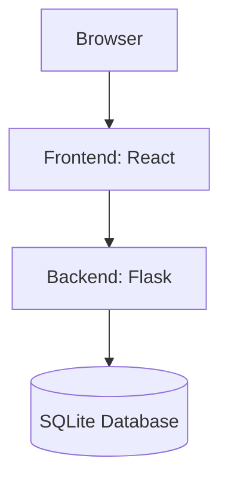

# Quiz Application

Full-stack quiz application with Python/Flask backend and React frontend.

## Quick Start

```bash
# Clone repository
git clone https://github.com/yourusername/quiz-application.git
cd quiz-application

# Start services
docker-compose down -v && docker-compose up --build
```

## Access Applications
- Frontend: http://localhost:3000
- Backend API: http://localhost:5001

## Default Credentials
- Admin: admin@example.com / password123
- User: user@example.com / password123

## Key Features
- User authentication (JWT)
- Quiz management system
- Progress tracking
- Result analytics
- Dockerized deployment

## Architecture


## Development
```bash
# Frontend development
cd quiz-frontend
npm install
npm run dev

# Backend development 
cd quiz-backend
python -m venv venv
source venv/bin/activate
pip install -r requirements.txt
python app.py
```

## or other than all above commands, one shot simple Docker
```
docker-compose down -v
docker-compose up --build
```